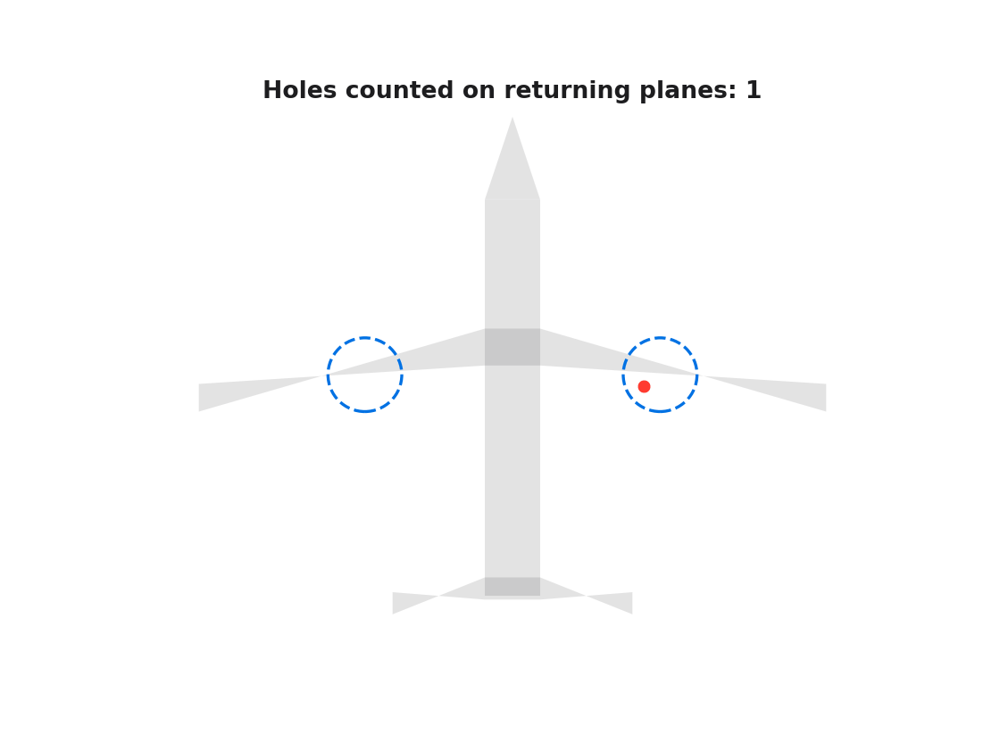
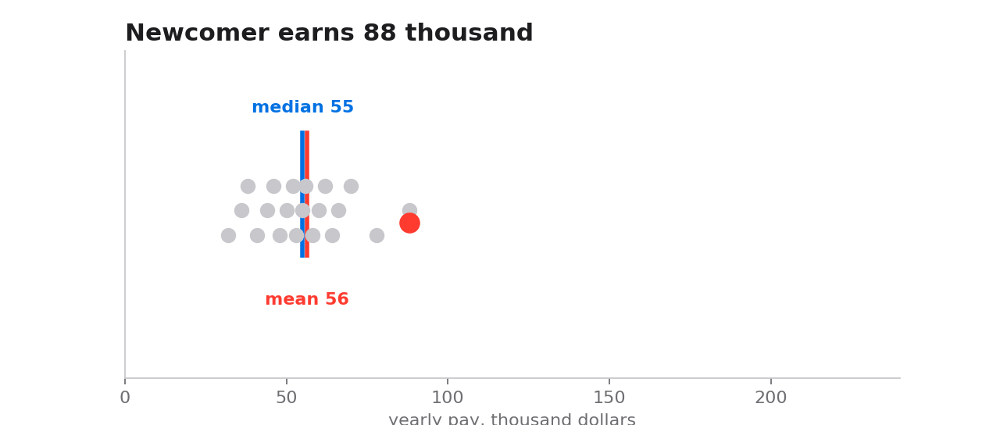
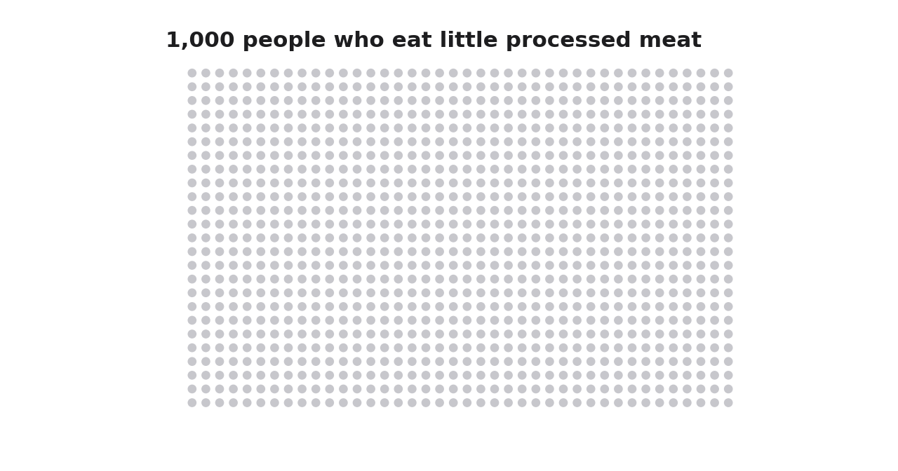
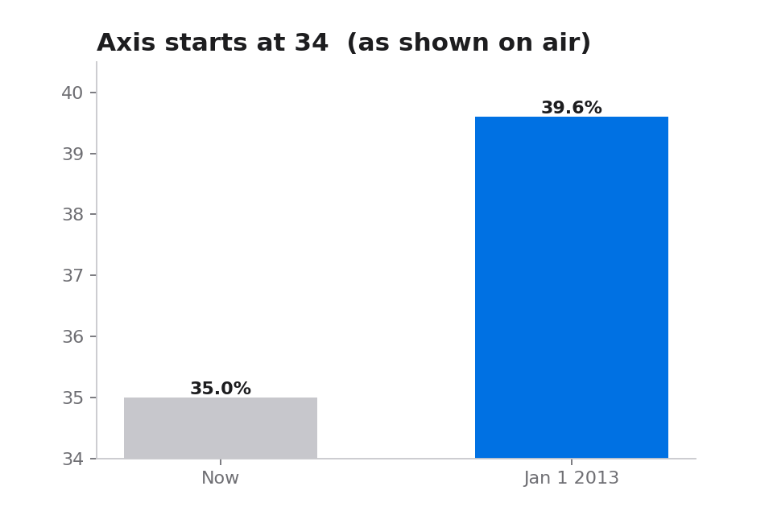
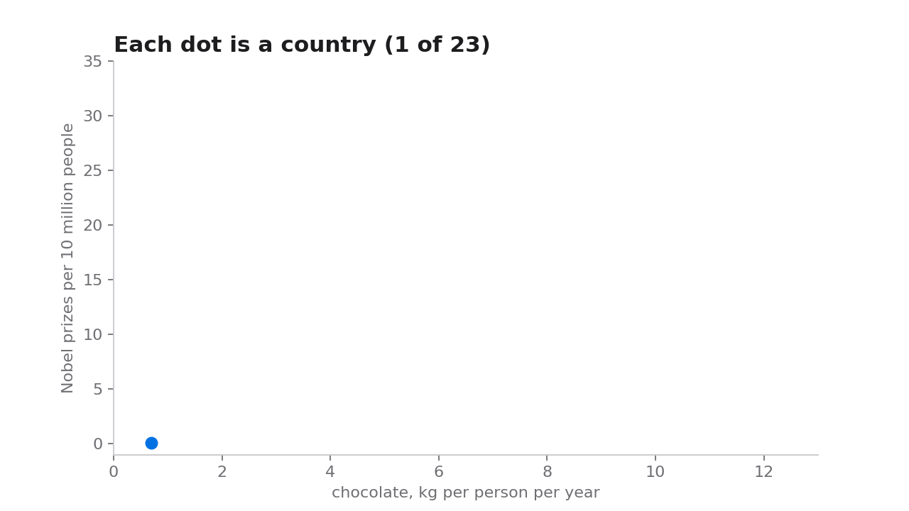
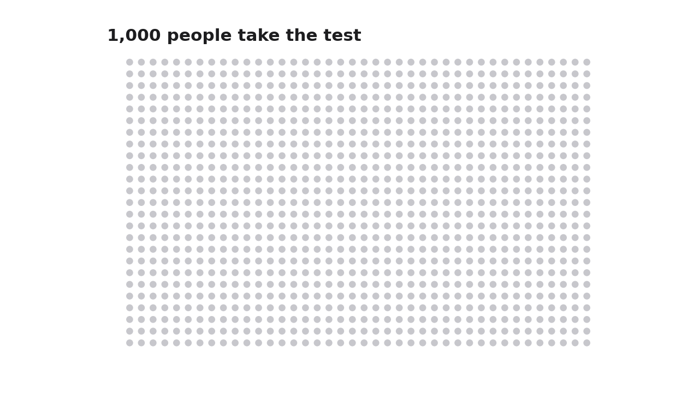
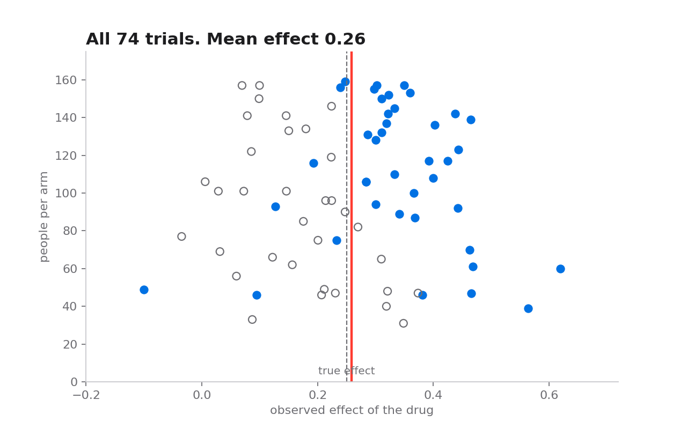

# Data Make Sins

Seven ways numbers fool people. Each one is a short post, a real case from the news, a small dataset analysed with pandas, a figure, and an animated figure. Everything runs in a notebook you can download and run.

Written in simple English on purpose.



## The seven mistakes

| # | Mistake | Real case | Notebook | Open in Colab |
|---|---------|-----------|----------|---------------|
| 1 | Survivorship bias | The bombers that came back, 1943 | [01_survivorship_bias](notebooks/01_survivorship_bias.ipynb) | [](https://colab.research.google.com/github/CS42org/data-make-sins/blob/main/notebooks/01_survivorship_bias.ipynb) |
| 2 | Mean instead of median | US wealth: mean 551,000, median 108,000 | [02_mean_vs_median](notebooks/02_mean_vs_median.ipynb) | [](https://colab.research.google.com/github/CS42org/data-make-sins/blob/main/notebooks/02_mean_vs_median.ipynb) |
| 3 | Relative risk without absolute risk | Bacon and the 18 percent, WHO 2015 | [03_relative_vs_absolute_risk](notebooks/03_relative_vs_absolute_risk.ipynb) | [](https://colab.research.google.com/github/CS42org/data-make-sins/blob/main/notebooks/03_relative_vs_absolute_risk.ipynb) |
| 4 | A chart axis that does not start at zero | Fox tax chart 2012, Georgia chart 2020 | [04_truncated_axis](notebooks/04_truncated_axis.ipynb) | [](https://colab.research.google.com/github/CS42org/data-make-sins/blob/main/notebooks/04_truncated_axis.ipynb) |
| 5 | Correlation is not causation | Chocolate and Nobel prizes, 2012 | [05_correlation_vs_causation](notebooks/05_correlation_vs_causation.ipynb) | [](https://colab.research.google.com/github/CS42org/data-make-sins/blob/main/notebooks/05_correlation_vs_causation.ipynb) |
| 6 | Base rate neglect | The 99 percent accurate test, Cardiff 2017 | [06_base_rate_neglect](notebooks/06_base_rate_neglect.ipynb) | [](https://colab.research.google.com/github/CS42org/data-make-sins/blob/main/notebooks/06_base_rate_neglect.ipynb) |
| 7 | Publication bias | 74 antidepressant trials, 2008 | [07_publication_bias](notebooks/07_publication_bias.ipynb) | [](https://colab.research.google.com/github/CS42org/data-make-sins/blob/main/notebooks/07_publication_bias.ipynb) |


Figures are not committed by hand. A GitHub Actions workflow runs every notebook on each push and commits the figures and the executed notebooks back to the repo.

## Preview

| | |
|---|---|
|  |  |
|  |  |
|  |  |

## Run it

On your computer:

```bash
git clone https://github.com/CS42org/data-make-sins.git
cd data-make-sins
pip install -r requirements.txt
jupyter lab
```

Open `notebooks/00_start_here.ipynb` and follow the links.

On Google Colab: click a badge in the table. Run the first cell, it downloads the repo.

## What is in the repo

```
notebooks/   one notebook per mistake, plus 00_start_here
data/        small CSV files used by the notebooks
figures/     every figure and GIF, built by GitHub Actions on each push
posts/       the seven posts as plain text, and the master list of 50 mistakes
web/         the animated web page (open index.html in a browser)
src/dms.py   shared colours and plot style
```

## The master list

The seven posts are the ones people fall for most often. The full list of 50 mistakes, grouped in six families, is in [posts/data-mistakes-list.md](posts/data-mistakes-list.md).

## Sources

Every real case links to the original reporting inside the post and the notebook. The main ones:

- Levitt, Freakonomics, 2008: Good to Great companies after the book
- UBS Global Wealth Report 2023: mean and median wealth per adult
- The Guardian and Cancer Research UK, 26 Oct 2015: processed meat and bowel cancer
- Fox Business, Cavuto, 31 Jul 2012, via FlowingData: the tax chart
- Business Insider, May 2020: the Georgia chart with dates out of order
- Messerli, New England Journal of Medicine, 10 Oct 2012, and Reuters: chocolate and Nobel prizes
- BBC News, 4 May 2018: face recognition at the Champions League final
- Turner et al, New England Journal of Medicine, 17 Jan 2008: selective publication of antidepressant trials
- Cochrane and BMJ, 10 Apr 2014: the Tamiflu data

Inspired by How to Lie with Statistics (Huff), The Art of Thinking Clearly (Dobelli) and Thinking, Fast and Slow (Kahneman).

## Note on the data

Two datasets are not real measurements. `chocolate_nobel.csv` holds values read from the published figure, so they are approximate. `georgia_cases_illustrative.csv` is invented to show the trick, not the real Georgia counts. Both are marked in the notebooks.

## Licence

MIT. Use it in class, in a talk, in a blog. A link back is welcome.
